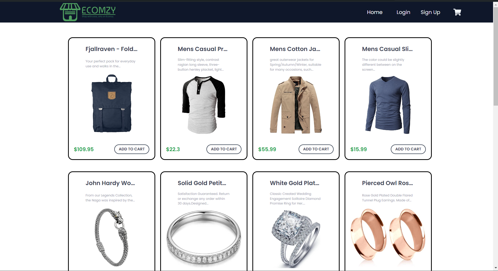
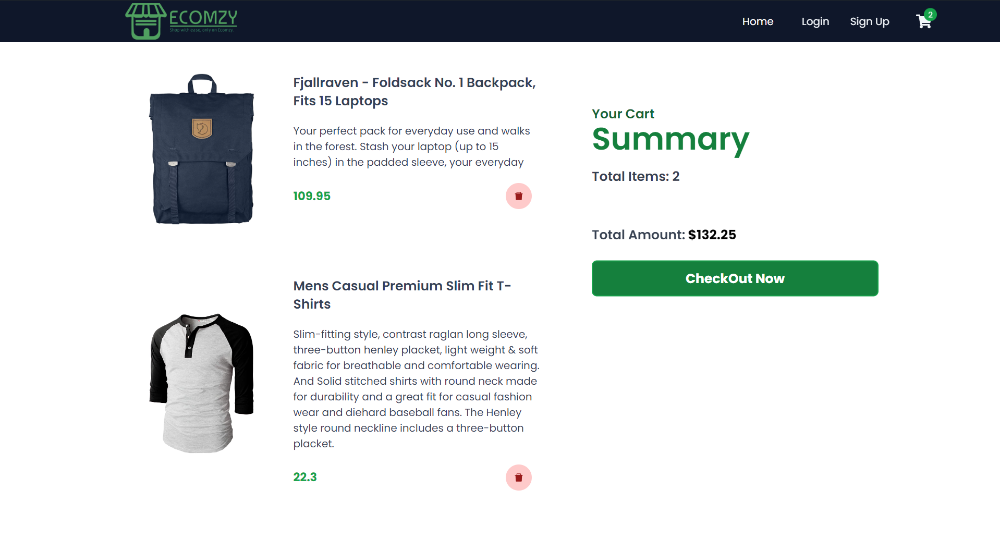

# Shopping Cart (Ecomzy)
website is hosted with netlify website link: 

https://shop-at-ecomzy.netlify.app/

Ecomzy is an ultimate online shopping destination. You can immerse yourself in a seamless and delightful shopping experience where convenience meets style.



## Features

Product Listing: Users can view a list of available products, including their name, price, and an option to add them to the cart.

Cart Management: Users can add products to the cart, adjust the quantity of each item, and remove items from the cart.



Total Calculation: The application calculates and displays the total price of all the products in the cart.

SignUp: Users can SignUp to the website so that they can use the Dashboard.


LogIn: Users can Login to the website by giving their credentials.


## Installation

To run the Shopping Cart locally, follow these steps:

1. Clone the repository:
```bash
 git clone https://github.com/AshutoshKumar0206/Ecomzy.git
```
2. Navigate to the project directory:
```bash
 cd Ecomzy
```
3. Install the dependencies:
```bash
 npm install
```
4. Start the development server:
```bash
 npm start
```
5. Open your browser and visit http://localhost:3000 to access the application.

## Additional Resources

If you're new to React or need a refresher, the following resources may be helpful:

1. [React Official Documentation](https://react.dev/blog/2023/03/16/introducing-react-dev): The official documentation for React, providing detailed guides, tutorials, and API references.

2. [Create React App](https://create-react-app.dev/docs/getting-started/): Official documentation for creating a new React app using Create React App.

3. [Tailwind CSS Official Documentation](https://tailwindcss.com/docs/installation): The official documentation for Tailwind CSS, providing information about the framework's utility classes and configuration options.


## Contribution

Contributions are welcome if you'd like to enhance the functionality or improve the code. Here's how you can contribute to the Shopping Cart project:

1. Fork the Repository.

2. Create a new branch: git checkout -b my-feature-branch.

3. Make your changes and commit them: git commit -m 'Add some feature'.

4. Push to the branch: git push origin my-feature-branch.

5. Submit a pull request.


## Acknowledgements

Thank you for your interest in the Shopping Cart project! If you have any questions or need further assistance, please don't hesitate to reach out. Happy shopping!

